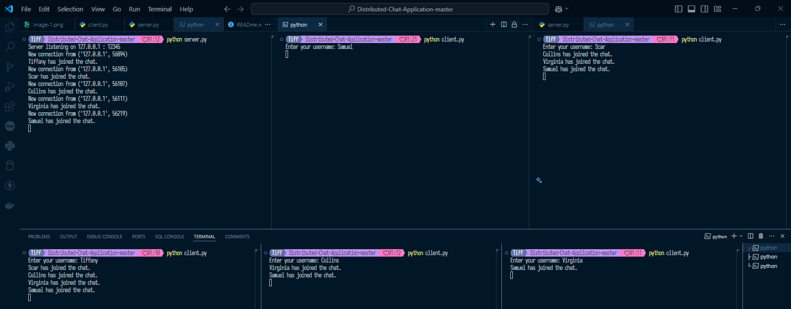
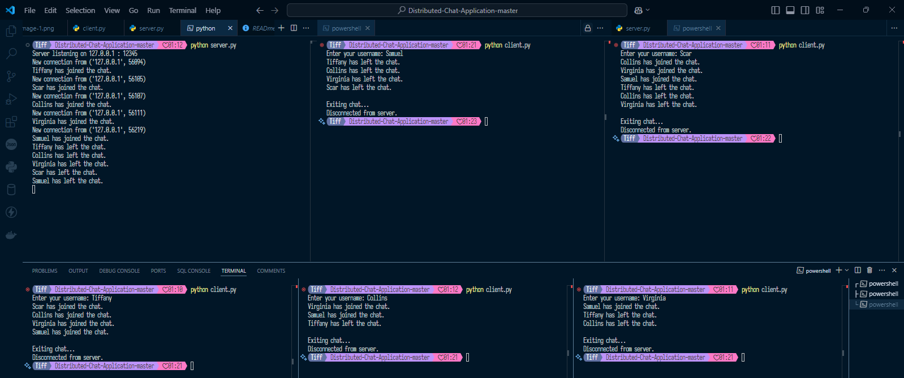

**User Guide**

**Running the Server using IP address:**
Download and extract the zip file from (https://github.com/RivoltaAlpha/Distributed-Chat-Application)

Make sure you have a python interpreter installed on all the devices to be used.
Make sure all the devices are on tthe same LAN.
Copy the client file and the audio file to a prefered folder on each client PC.
Open the folder where you extracted the zip file, press shift and right mouse key at the same time to open the folder in PowerShell.

Open both the server and client  file on visual studio code to edit the SERVER_HOST IP address to be the address of the machine that will run ther server.py file.

To get the IP of the host, open cmd as admin and typ in " ipconfig /all " find the ip of the network adapter you are using, could be ethernet or wifi adapter.
copy the IP address to replace on the SERVER_HOST above.

On the powershell terminal, now run " python server.py " to start the server.

**Connecting Clients:**
Open the folder where the client and audio file were stored on the client machines and open the folder in powershell as above.
Run python client.py on the client machines to connect multiple clients.

Usage:
Type and send messages in each client. Type "exit" to disconnect a client.

**Running the Server locally:**
In a terminal, run python server.py to start the server.
Connecting Clients:
Run python client.py in separate terminals to connect multiple clients.

Usage:
Type and send messages in each client. Type "exit" to disconnect a client.

**Testing the System** 
Start the server in one terminal.
Connect multiple clients from separate terminals.
Send messages and observe if messages are relayed correctly.
Test failover by stopping one server node and observing if clients attempt to reconnect.

**To close client connection**
Type "exit" on the client terminal 

**To close server connection**
Exception Handling:

The try block contains the main loop for accepting new connections.
When KeyboardInterrupt (from pressing Ctrl+C) is detected, the except KeyboardInterrupt block is triggered.

Output:
A message confirms that the server is shutting down, ensuring a smooth exit.
This allows you to shut down the server by pressing Ctrl+C without leaving any active client connections hanging.

All client connections are closed.
The server socket is closed.

**Broadcast Sample**

When a new client connects to the server, The server broadcasts the message to all the other clients and a notification is sent. Each time a client sends a message its broadcasted to all the other clients by the server. 
If a client leaves the chat, a notification and a broadcast message are sent

