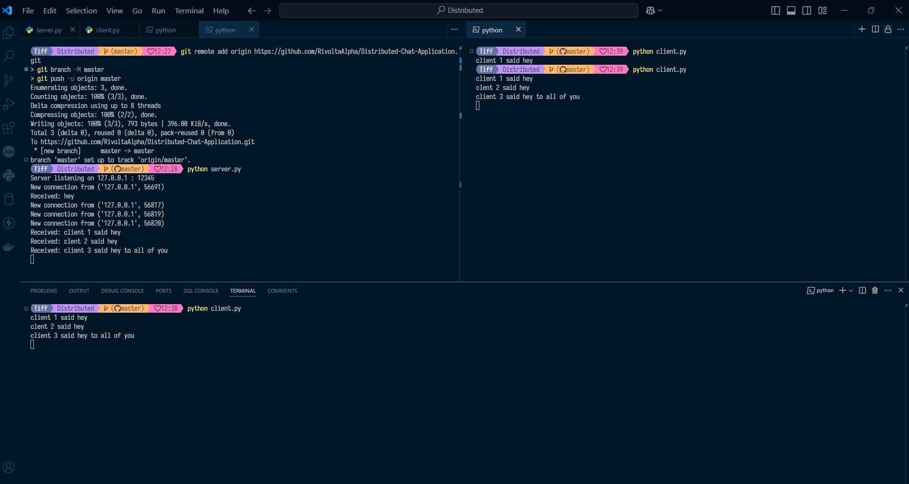
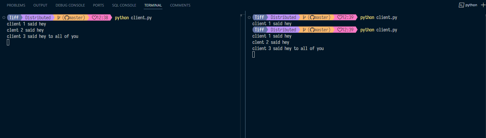
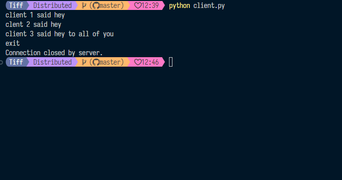
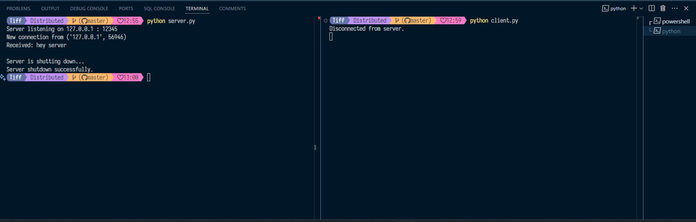
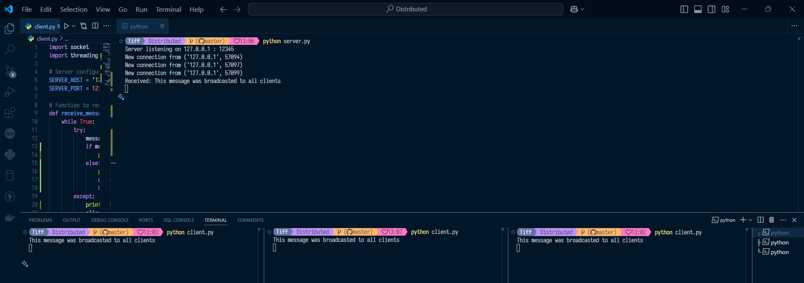

**User Guide**
Running the Server:
In a terminal, run python server.py to start the server.
Connecting Clients:
Run python client.py in separate terminals to connect multiple clients.
Usage:
Type and send messages in each client. Type "exit" to disconnect a client.

**Testing the System** 
Start the server in one terminal.
Connect multiple clients from separate terminals.
Send messages and observe if messages are relayed correctly.
Test failover by stopping one server node and observing if clients attempt to reconnect.

**To close client connection**
Type "exit" on the client terminal 

**To close server connection**
Exception Handling:

The try block contains the main loop for accepting new connections.
When KeyboardInterrupt (from pressing Ctrl+C) is detected, the except KeyboardInterrupt block is triggered.

Graceful Shutdown:
All client connections are closed.
The server socket is closed.

Output:
A message confirms that the server is shutting down, ensuring a smooth exit.
This allows you to shut down the server by pressing Ctrl+C without leaving any active client connections hanging.

**Broadcast**
